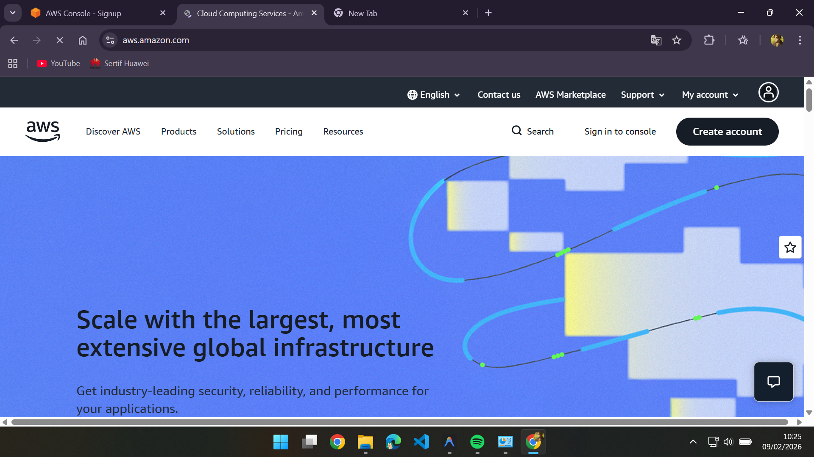
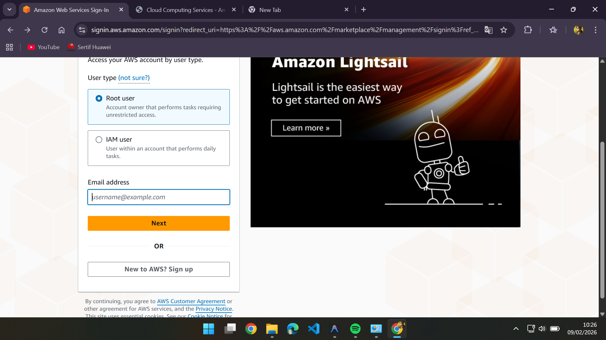
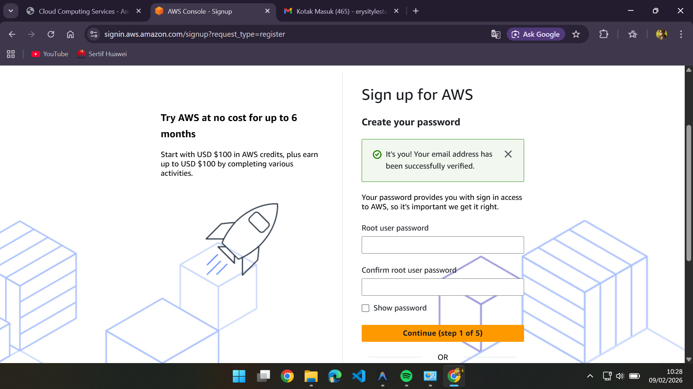
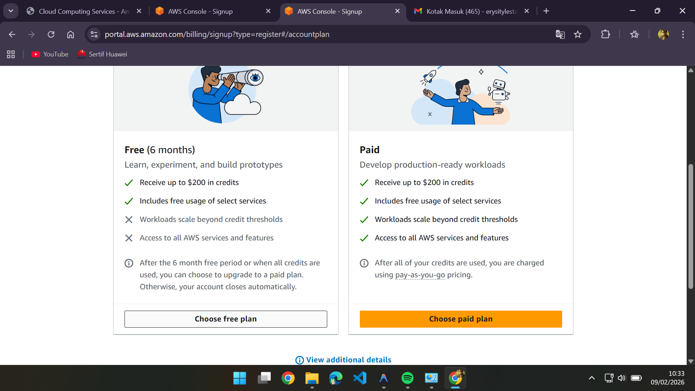
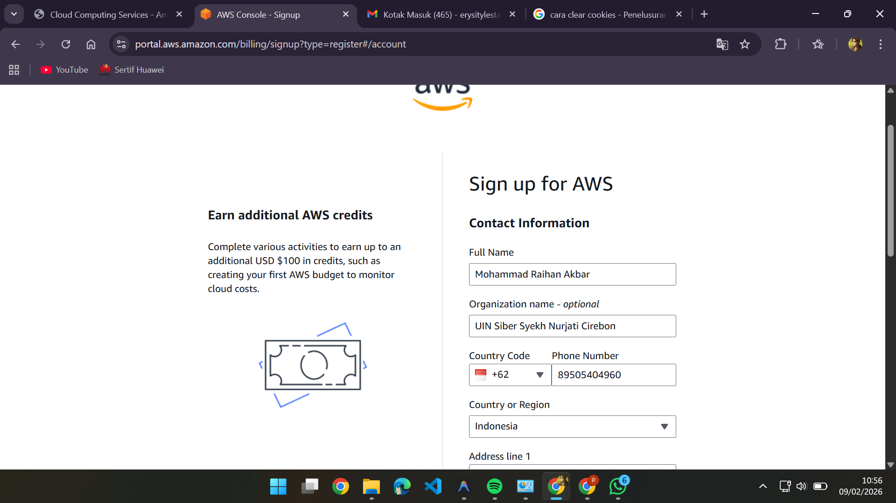
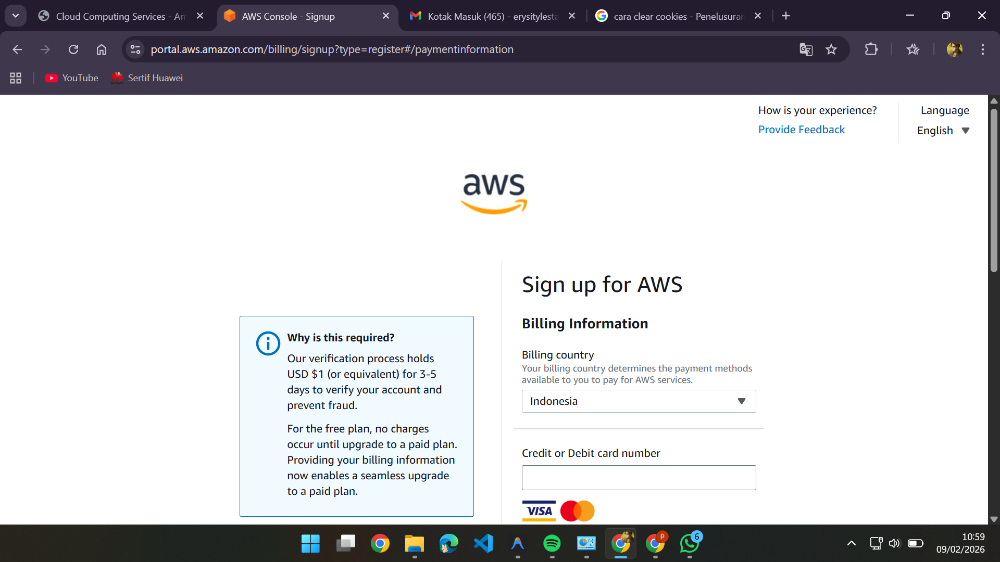
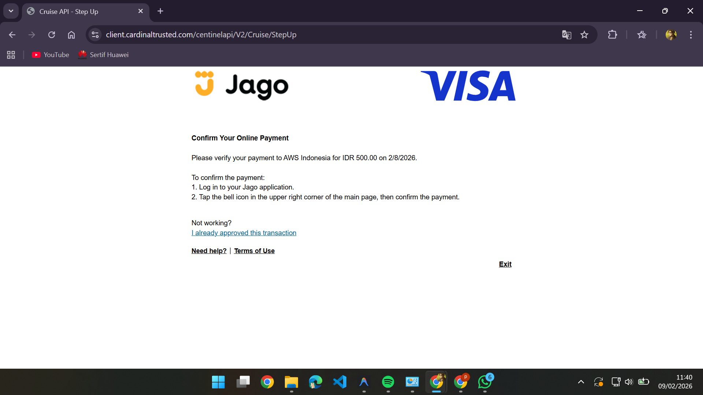
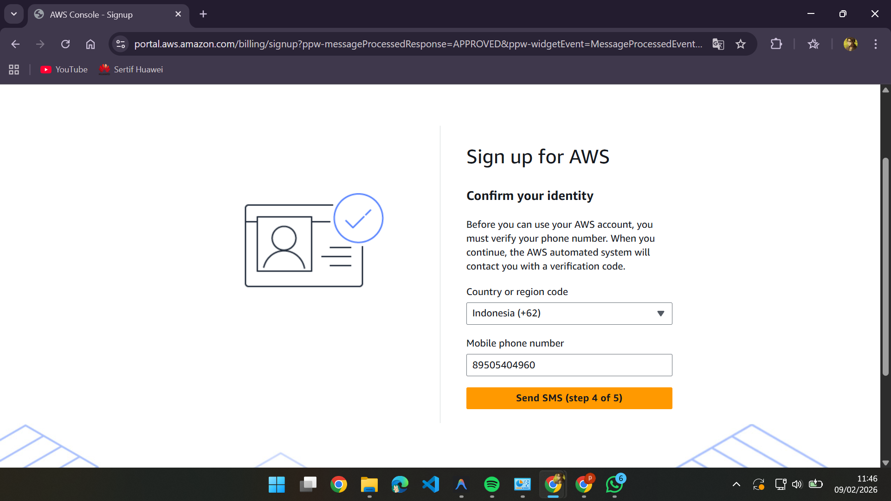
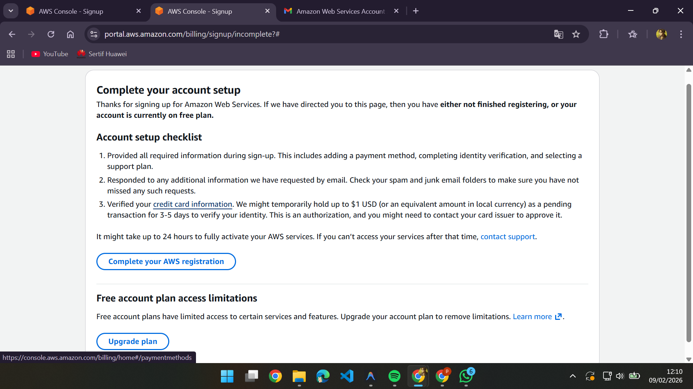

1. Buka laman resmi AWS https://aws.amazon.com/

2. Buat akun baru di aws

3. verifikasi akun AWS

4. Buat Password akun AWS

Lupa screen shot tampilannya jadi terskip

5. Choose Free Plan

6. Mengisi Contact Information

7. Mengisi Billing Information

8. Confirm Online Payment

9. Confirm Online Payment in Bank Jago

10. Sign in for Aws

11. Konfirmasi bisa 3-5

12. Selesai 100$ saldo

